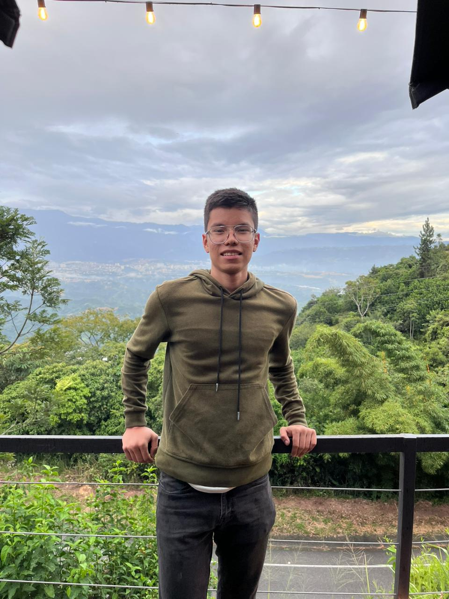

# About Me

Here is **Fabian Perez**.

I am I am a computer science student at Universidad Industrial de Santander (UIS) in Colombia. I am currently an undergraduate pursuing my bachelor's degree in computer science. I have strong skills in software development and deep learning. My expertise across both these areas allows me to create innovative solutions by bringing them together

If you are interested in any aspect of me, I would love to collaborate, please email me

 **Best wishes for 2024 🎊 Cheers!**

## Research Interests

- Deep Learning
- Privacy Preserving Deep Learning
- Vision Transformers
- Applied Machine Learning

My research focuses on practical applications of deep learning. I am interested in democratizing deep learning by bringing this advanced technology to mass-market products and service

 

---

## Academic Background

- **April 2020 - today:** Univerisdad Industrial de Santander (BEng)

 

---

## News and Updates

- **Dec 2023：** 🚀 My first conference paper was accepted to ICCASP 2024!

 